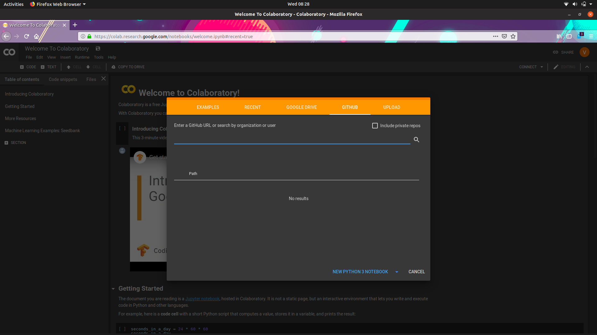
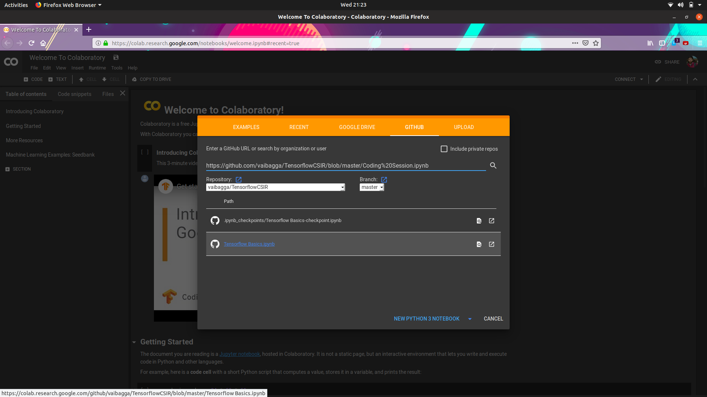
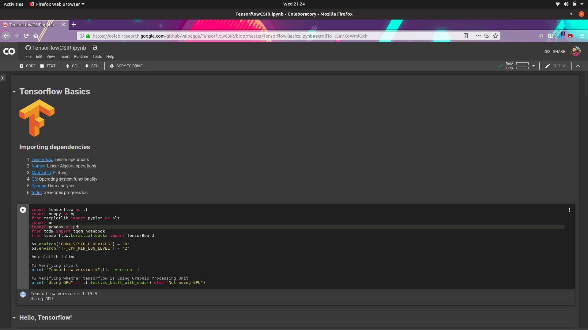

# TensorflowCSIR
Tensorflow tutorial for workshop on Data Science organized by CSIR
[Link for Presentation](https://docs.google.com/presentation/d/1XSbHaK3HFKenuJ1iBiFWoIVmIX6wbAKHlCMKGfKDuX8/edit?usp=sharing)

## Instructions for running on local machine
### Installing dependencies

```sh
$ git clone https://github.com/vaibagga/TensorflowCSIR
$ pip install -r requirements.txt
```


### Running
Run the jupyter notebook

```sh
$ cd TensorflowCSIR
$ jupyter notebook 'Coding Session'
```


## Instructions for running on Google Colab
1. Go to [Google Colaboratory](https://colab.research.google.com/)

2. Select GitHub from top panel
3. Enter URL: https://github.com/vaibagga/TensorflowCSIR/blob/master/Coding%20Session.ipynb

4. Run notebook


## Licence
GPL 3.0


